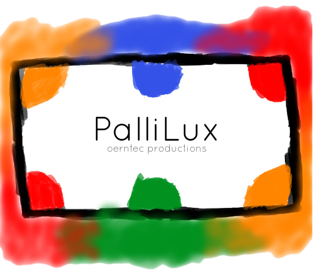
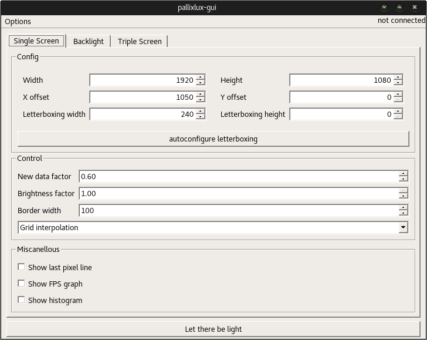
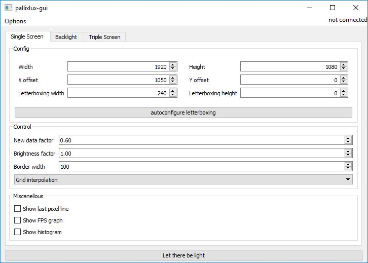

<p align="center"></p>
PalliLux's primary goal is to create an Ambilight-like experience on computers using an Arduino.  
It is, however, also possible to supply any other RGB data.  

# Download
Download the gui here: [latest release](https://github.com/enra64/PalliLux/releases/latest). After that, you only need to flash the sketch contained in pallilux-arduino to an arduino after adjusting the number of LEDs.

# Example
Pallilux running on my computer:


# Currently available modes
## "Ambilight"
This default mode mirrors the colors displayed on the borders of your screen to the leds behind your screen. The single screen mode can be used by users having a simple rectangle as display space. If you have three monitors, any display space can be configured using the triple screen mode.

## Background
Simply show a single constant color on all LEDs.

## Rotating Backlight
Rotates a rainbow around the leds. The minimum and maximum hue as well as rotation speed can be adjusted. Additionally, a breathing effect can be applied.

## Spectrometer
The spectrometer uses PulseAudio to display a spectrogram of the audio currently played in a color of choice. It is not available for Windows.

# Advanced Usage

## Self compiled host code
The host code in [pallilux](pallilux/) is powered by cmake. By default, the [CMakeLists.txt](pallilux/CMakeLists.txt) creates a dynamic library in debug mode. [There are multiple options available](cmake_options.md). By far the easiest way to see how to get going is to look at [main.cpp](pallilux/main.cpp).

## GUI
There is a GUI available in [pallilux-gui](pallilux-gui/).

Linux             |  Windows
:-------------------------:|:-------------------------:
  |  

# Documentation
Use the Doxyfile in [pallilux](pallilux/) to generate the full documentation. [Short info about the classes](class_info.md).

## SpectrometerRgbLineProvider
This class can create a spectrogram of your current music using the fftw3 library and pulseaudio.

## DataFilters
```DataFilter``` implementations may modify the RgbLineProvider result rgb data in any way, for example to reduce the overall brightness or modify color behaviour. They can be added like this:
```c++
unique_ptr<DataFilter> myFilter = unique_ptr<DataFilter>(new MyFilter()));
connector.addFilter("myFilterId", move(myFilter));
```

## Existing ```DataFilter``` implementations
|Filter class|effect|
|------------|------|
|BrightnessFilter|Apply a factor to all rgb channels|
|LowPassFilter|Smooth out the color changes by mixing old and new data|
|LinearFactorFilter|Suppress/enhance bright/dark colors|

## Contributors
* [gSilas](https://github.com/gSilas/) for the splash screen image and icon
* CImg: the image library used by the processing system
* StackOverflow: so much
