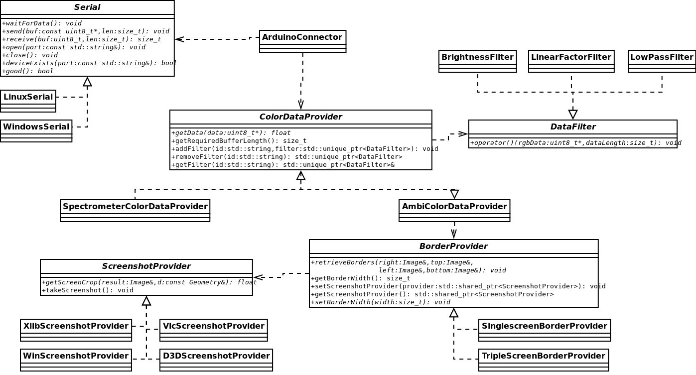

# Class diagram


# ArduinoConnector
An ```ArduinoConnector``` instance will communicate with the slave Arduino. To do so, it needs a class instance implementing the ```RgbLineProvider``` interface, which will supply the RGB data for the arduino. 

# ColorDataProvider
The abstract class provides the ```DataFilter``` infrastructure, so you only need to implement ```void getData(uint8_t* data)```, which should overwrite ```data``` with the new rgb data for the leds.  

## ```SpectrometerRgbLineProvider```
```SpectrometerRgbLineProvider``` uses PulseAudio and fftw3 libraries to provide spectrogram led data.

## ```AmbiColorDataProvider```
```AmbiColorDataProvider``` uses a ```BorderProvider``` to get images of the borders. It will then scale them down to be one pixel high, and as wide as leds exist using Magick++, so the rgb data can easily be extracted.

# ```BorderProvider```
```BorderProviders``` only need to implement ```void retrieveBorders(Magick::Image& right, Magick::Image& top, Magick::Image& left, Magick::Image& bottom);```. The images should contain the respective borders after the function has been called. The resolution does not matter, although a higher resolution needs more processing time.

## ```SingleScreenBorderProvider```
The ```SingleScreenBorderProvider``` class provides borders of a single screen.

## ```TripleScreenBorderProvider```
The ```TripleScreenBorderProvider``` class is designed to take border images of my specific screen configuration with 3 screens.

# ```ScreenshotProvider```
```ScreenshotProvider``` implementations should provide ```float getScreenCrop(Image& result, const Geometry& d);```, where d contains size and offset of the screenshot, and ```void takeScreenshot();```, which is called before ```getScreenCrop``` to reduce processing time for screenshot methods where you would only want to read the screen once.

## ```XlibScreenshotProvider```
Use Xlib to make the screenshots. The smaller the area, the faster it is.

## ```WinScreenshotProvider```
Use GDI to make the screenshots. On my machine, this only reaches ~15 fps.

## ```D3DScreenshotProvider```
Use DirectX 9 to make the screenshots. On my machine, this only reaches ~15 fps.
